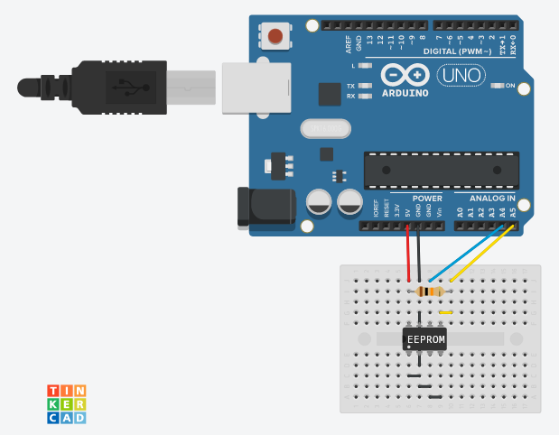

# PyEEPROM

Programa con interfaz gráfica para la lectura y escritura de datos en memoria EEPROM a través de Arduino.

### ¿Por qué buscar usar memorias tipo EEPROM?

Aunque la gran desventaja de este tipo de memorias es su baja capacidad (en el orden de KB) y su velocidad de lectura/escritura; estas son fácilmente reemplazables, toleran altas y bajas temperaturas, mantienen la información por alrededor de un siglo y soportan hasta un millón de reescrituras, lo que es muy relevante si se desea almacenar información en condiciones exigentes comparado a lo que ofrecen otros tipos de memoria más comunes como lo son las memorias flash USB.

### ¿Por qué usar este programa?

La memoria EEPROM no tiene la habilidad de asignar la información entrante en su interior por sí misma, su escritura y lectura se realiza de manera directa, similar al uso de un array, por tanto, este programa se encarga de realizar las asignaciones, borrado y listado de los datos usando una GUI. Además, en caso de no disponer de la GUI los datos escritos son fácilmente legibles por un humano, reduciendo la probabilidad de perdida de datos debida por ejemplo a la corrupción de un sistema de archivo común, como ocurre en caso de usar memorias USB.

## Esquema del montaje

En este caso particular se emplea una memoria EEPROM Atmel AT24C32 en conjunto con un Arduino UNO.

### Montaje

### Esquema

